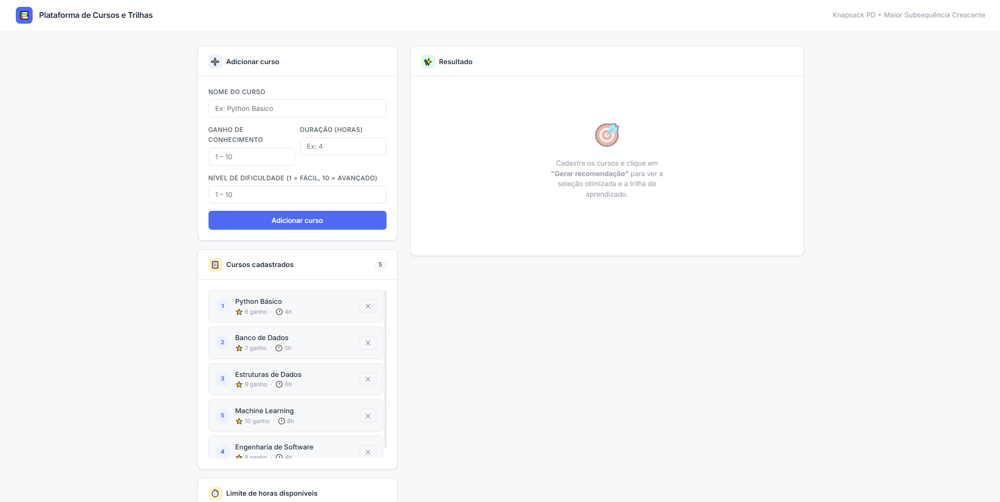
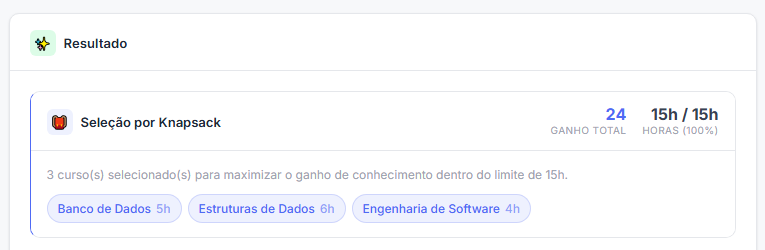
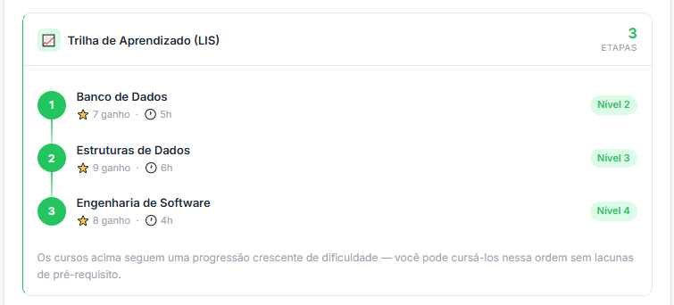

# G9_Programacao-Dinamica_PA-26.1

Número da Lista: 09<br>
Conteúdo da Disciplina: Programação Dinâmica<br>

## Alunos

| Matrícula  | Aluno                    |
| ---------- | ------------------------ |
| 23/1027023 | Amanda Cruz Lima         |
| 22/1031158 | Felipe de Oliveira Motta |

## Sobre

A Plataforma de Seleção de Cursos e Trilhas é uma aplicação web no formato Single Page Application voltada para a recomendação de cursos com base em restrições de tempo e progressão de dificuldade.

A aplicação utiliza dois algoritmos clássicos de Programação Dinâmica para resolver problemas relacionados à organização de estudos:

1. Otimizador de Cursos (Knapsack PD): seleciona o conjunto de cursos com maior ganho de conhecimento possível sem ultrapassar o limite máximo de horas informado pelo usuário.

2. Gerador de Trilha de Aprendizado (Maior Subsequência Crescente): organiza os cursos selecionados em uma sequência crescente de nível de dificuldade, criando uma progressão lógica de aprendizado.

## Screenshots

1. Tela Inicial



2. Recomendação de Cursos



3. Trilha de Aprendizado



## Vídeo de Apresentação

## Instalação

```bash
# 1. Iniciar uma venv
python -m venv .venv

# 2.1 Ativar a venv (Linux)
source .venv/bin/activate

# 2.2 Ativar a venv (Windows)
.venv\Scripts\activate

# 3. Instalar dependências
pip install flask

# 4. Rodar o servidor
python app.py
# → http://localhost:5000
```